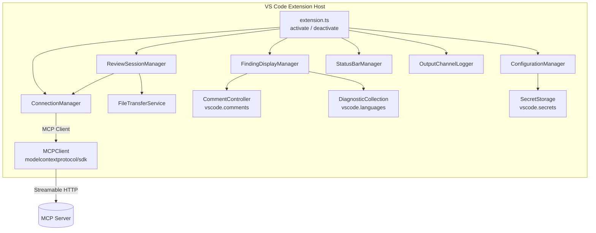

# Design Document

## Overview

The VS Code Code Review Extension integrates an AI-powered code review agent into the editor via the Model Context Protocol (MCP). The extension acts as an MCP client that communicates with an external MCP server hosting the review agent. Review findings are surfaced through two complementary VS Code APIs: the Comments API (inline comment threads) and the Diagnostics API (Problems panel integration).

The extension is written in TypeScript, following standard VS Code extension conventions. It uses the official `@modelcontextprotocol/sdk` package for MCP communication over Streamable HTTP transport.

### Key Design Goals

- **Non-intrusive**: Review sessions run asynchronously; failures never disrupt the editor state.
- **Incremental**: Workspace reviews use server-side index timestamps to avoid re-sending unchanged files.
- **Secure**: Authentication tokens are stored in VS Code's `SecretStorage` (encrypted, not synced).
- **Resilient**: Automatic reconnection with exponential backoff; per-session cancellation support.

---

## Architecture

The extension is structured as a set of collaborating services, each with a single responsibility. The `activate` entry point wires them together and registers VS Code commands and event listeners.



### Component Responsibilities

| Component | Responsibility |
|---|---|
| `ConfigurationManager` | Reads/validates VS Code settings; retrieves auth token from `SecretStorage` |
| `ConnectionManager` | Owns the MCP `Client` instance; handles connect, disconnect, reconnect with backoff |
| `MCPClient` | Thin wrapper around `@modelcontextprotocol/sdk` `Client` + `StreamableHTTPClientTransport` |
| `ReviewSessionManager` | Orchestrates review sessions; handles cancellation, progress notifications |
| `FileTransferService` | Reads workspace files; queries index timestamp; performs bounded-concurrency file transfers |
| `FindingDisplayManager` | Coordinates `CommentController` and `DiagnosticCollection` updates; applies sort/filter logic to displayed findings |
| `StatusBarManager` | Manages the connection status bar item |
| `OutputChannelLogger` | Writes structured logs to the "Code Review" output channel |

---

## Components and Interfaces

### ConfigurationManager

Reads from the `codeReview` configuration namespace and exposes a typed settings object.

```typescript
interface ExtensionConfig {
  serverUrl: string;                  // MCP server URL
  requestTimeoutMs: number;           // default: 30000
  maxConcurrentTransfers: number;     // default: 5, min: 1, max: 50
  showInformationFindings: boolean;   // default: true
  sortField: 'priority' | 'severity' | 'confidence' | 'importance';
  filter: {
    minPriority: number;
    minSeverity: number;
    minConfidence: number;
    minImportance: number;
  };
}

interface ConfigurationManager {
  getConfig(): ExtensionConfig;
  getAuthToken(): Promise<string | undefined>;  // reads from SecretStorage
  setAuthToken(token: string): Promise<void>;
  onDidChangeConfig(listener: (config: ExtensionConfig) => void): vscode.Disposable;
  isLocalAddress(url: string): boolean;
}
```

`isLocalAddress` returns `true` when the URL hostname is `localhost`, `127.0.0.1`, or `::1`.

### ConnectionManager

Manages the lifecycle of the MCP client connection.

```typescript
interface ConnectionManager {
  connect(): Promise<void>;
  disconnect(): Promise<void>;
  getClient(): Client | null;
  readonly isConnected: boolean;
  onDidChangeConnection(listener: (connected: boolean) => void): vscode.Disposable;
}
```

Reconnection uses exponential backoff: delays of 1 s, 2 s, 4 s before giving up (3 attempts total). On each failed attempt the error is logged; after all attempts are exhausted a VS Code error notification is shown.

### ReviewSessionManager

Tracks active sessions and enforces the single-session-per-file rule.

```typescript
type ReviewScope =
  | { kind: 'file'; uri: vscode.Uri }
  | { kind: 'selection'; uri: vscode.Uri; range: vscode.Range }
  | { kind: 'workspace' };

interface ReviewSessionManager {
  startSession(scope: ReviewScope): Promise<void>;
  cancelSession(uri?: vscode.Uri): void;   // undefined = cancel all
  readonly activeSessions: Map<string, ReviewSession>;
}

interface ReviewSession {
  id: string;
  scope: ReviewScope;
  cancellationToken: vscode.CancellationToken;
  startedAt: Date;
}
```

When a new session is triggered for a URI that already has an active session, the existing session is cancelled before the new one starts.

### FileTransferService

Handles workspace file enumeration and incremental sync with bounded concurrency.

```typescript
interface IndexTimestampResponse {
  timestamp: string | null;   // ISO 8601 or null
}

interface FilePayload {
  path: string;               // workspace-relative path
  content: string;
  languageId: string;
  lastModified: string;       // ISO 8601
}

const DEFAULT_MAX_CONCURRENT_TRANSFERS = 5;

interface FileTransferService {
  queryIndexTimestamp(): Promise<IndexTimestampResponse>;
  buildAndTransfer(
    uris: vscode.Uri[],
    sinceTimestamp: string | null,
    concurrency?: number,
  ): Promise<number>;
}
```

`buildAndTransfer` implements a fused stat → filter → read → transfer pipeline using a bounded concurrency pool. A fixed number of worker coroutines (controlled by the `concurrency` parameter, default `DEFAULT_MAX_CONCURRENT_TRANSFERS = 5`) pull URIs from a shared index. Each worker stats the file, checks the timestamp filter, reads content only if the file passes, transfers it immediately (so content can be garbage-collected), and moves on. This keeps at most `concurrency` file contents in memory at any time.

The `concurrency` value is read from the `codeReview.maxConcurrentTransfers` configuration setting (integer, min 1, max 50, default 5). The value is floored and clamped to a minimum of 1 at runtime.

Returns the number of files actually transferred. Individual file failures are logged and skipped without aborting the batch.

### FindingDisplayManager

Coordinates the two display surfaces and applies sort/filter options.

```typescript
interface FindingSortFilterOptions {
  sortField: 'priority' | 'severity' | 'confidence' | 'importance';
  filter: {
    minPriority: number;
    minSeverity: number;
    minConfidence: number;
    minImportance: number;
  };
}

interface FindingDisplayManager {
  applyFindings(uri: vscode.Uri, findings: Finding[]): void;
  clearFindings(uri: vscode.Uri): void;
  clearAllFindings(): void;
  dismissThread(thread: vscode.CommentThread): void;
  updateSortFilter(options: FindingSortFilterOptions): void; // re-applies to all displayed findings
}
```

`applyFindings` atomically replaces both the diagnostic entries and comment threads for the given URI, applying the current sort/filter options.

`updateSortFilter` re-sorts and re-filters all currently displayed findings across all URIs without requiring a new review session.

### StatusBarManager

```typescript
interface StatusBarManager {
  setConnected(serverUrl: string): void;
  setDisconnected(): void;
  setReviewing(): void;
  dispose(): void;
}
```

The status bar item shows:
- `$(check) Code Review: Connected` (green) when connected
- `$(x) Code Review: Disconnected` (red) when not connected
- `$(sync~spin) Code Review: Reviewing…` during an active session

---

## Data Models

### Finding

The central data structure produced by parsing MCP tool results.

```typescript
interface Finding {
  id: string;                  // UUID, generated on parse
  filePath: string;            // absolute path
  startLine: number;           // 0-indexed
  endLine: number;             // 0-indexed, inclusive
  message: string;
  suggestion?: string;
  confidence: number;          // 0.0–1.0
  severity: number;            // 0.0–1.0
  importance: number;          // 0.0–1.0
  priority: number;            // 0.0–1.0, combined score
  dismissed: boolean;          // runtime state, not persisted
}
```

### Severity Mapping

The Finding's numeric `severity` score is mapped to VS Code `DiagnosticSeverity` using the following thresholds:

| Severity score range | VS Code `DiagnosticSeverity` |
|---|---|
| 0.0–0.33 | `DiagnosticSeverity.Information` |
| 0.34–0.66 | `DiagnosticSeverity.Warning` |
| 0.67–1.0 | `DiagnosticSeverity.Error` |

### Raw Agent Result (MCP tool response)

The extension expects the MCP server to expose a tool (e.g. `review_code`) whose result content is a JSON array of raw result objects:

```typescript
interface RawFindingResult {
  filePath: string;       // required
  startLine: number;      // required
  endLine: number;        // required
  message: string;        // required
  suggestion?: string;    // optional
  confidence: number;     // required, 0.0–1.0
  severity: number;       // required, 0.0–1.0
  importance: number;     // required, 0.0–1.0
  priority: number;       // required, 0.0–1.0
}
```

Results missing any of the required fields (`filePath`, `startLine`, `endLine`, `message`, `confidence`, `severity`, `importance`, or `priority`) are logged as warnings and skipped (Requirement 3.2).

### Configuration Schema (`package.json` contribution)

```json
{
  "codeReview.serverUrl": {
    "type": "string",
    "default": "http://localhost:3000/mcp",
    "description": "URL of the MCP server hosting the code review agent."
  },
  "codeReview.requestTimeoutMs": {
    "type": "number",
    "default": 30000,
    "description": "Request timeout in milliseconds."
  },
  "codeReview.maxConcurrentTransfers": {
    "type": "number",
    "default": 5,
    "minimum": 1,
    "maximum": 50,
    "description": "Maximum number of files transferred to the MCP server in parallel."
  },
  "codeReview.showInformationFindings": {
    "type": "boolean",
    "default": true,
    "description": "Whether to display information-severity findings."
  },
  "codeReview.sortField": {
    "type": "string",
    "enum": ["priority", "severity", "confidence", "importance"],
    "default": "priority",
    "description": "Score field used to sort findings (descending)."
  },
  "codeReview.filter.minPriority": { "type": "number", "default": 0.0, "minimum": 0.0, "maximum": 1.0 },
  "codeReview.filter.minSeverity": { "type": "number", "default": 0.0, "minimum": 0.0, "maximum": 1.0 },
  "codeReview.filter.minConfidence": { "type": "number", "default": 0.0, "minimum": 0.0, "maximum": 1.0 },
  "codeReview.filter.minImportance": { "type": "number", "default": 0.0, "minimum": 0.0, "maximum": 1.0 }
}
```

The authentication token is stored in `vscode.ExtensionContext.secrets` under the key `codeReview.authToken` and is never written to `settings.json`.

### VS Code Comment Model

Each `Finding` maps to a `vscode.CommentThread` with one or two `vscode.Comment` entries:

```
CommentThread (uri, range)
  └── Comment #1: body = finding.message
                  label = "P: 0.85 | S: 0.72 | C: 0.90 | I: 0.80"
  └── Comment #2 (optional): body = finding.suggestion, label = "Suggestion"
```

The label shows all four scores in the format `P: <priority> | S: <severity> | C: <confidence> | I: <importance>`, each formatted to 2 decimal places.

The `CommentThread.contextValue` is set to `"codeReviewFinding"` to enable context-menu commands (e.g. dismiss).

---

## Correctness Properties

*A property is a characteristic or behavior that should hold true across all valid executions of a system — essentially, a formal statement about what the system should do. Properties serve as the bridge between human-readable specifications and machine-verifiable correctness guarantees.*

### Property 1: Finding Serialization Round-Trip

*For any* valid `Finding` object, serializing it to JSON and deserializing it back SHALL produce an equivalent `Finding` object with identical `filePath`, `startLine`, `endLine`, `message`, `confidence`, `severity`, `importance`, `priority`, and `suggestion` fields.

**Validates: Requirements 3.5**

### Property 2: Invalid Finding Rejection

*For any* raw result object that is missing at least one of the required fields (`filePath`, `startLine`, `endLine`, `message`, `confidence`, `severity`, `importance`, or `priority`), the parser SHALL reject it and SHALL NOT produce a `Finding` from it — the output set of findings SHALL be unchanged.

**Validates: Requirements 3.2**

### Property 3: Incremental Sync Correctness

*For any* set of workspace files and any non-null `Index_Timestamp` value `T`, the set of files selected for transfer SHALL be exactly the subset whose `lastModified` time is strictly after `T` — no more, no fewer. When `T` is `null`, all files SHALL be included.

**Validates: Requirements 2.5**

### Property 4: Information Finding Filter

*For any* list of `Finding` objects with mixed severity scores, when `showInformationFindings` is `false`, the filtered list passed to both `DiagnosticCollection` and `CommentController` SHALL contain no findings with `severity <= 0.33` (information-mapped), and all findings with `severity > 0.33` SHALL be preserved unchanged.

**Validates: Requirements 6.5**

### Property 5: Diagnostic–Comment Consistency

*For any* completed `Review_Session` producing a list of findings (after applying the information-severity filter), the set of diagnostics in `Diagnostic_Collection` and the set of comment threads in `Comment_Controller` SHALL each contain exactly one entry per finding, associated with the correct file URI and line range.

**Validates: Requirements 4.1, 4.2, 5.1**

### Property 6: Session Replacement Idempotence

*For any* file URI, applying a second set of findings after a first set SHALL result in the same final state in both `Diagnostic_Collection` and `Comment_Controller` as if only the second set had ever been applied — no residual entries from the first set SHALL remain.

**Validates: Requirements 4.3, 5.4**

### Property 7: Comment Content Fidelity

*For any* `Finding` object, the comment thread created by `Comment_Controller` SHALL have its first comment body equal to `finding.message` and its label equal to the string `"P: <priority> | S: <severity> | C: <confidence> | I: <importance>"` (each score formatted to 2 decimal places); and if `finding.suggestion` is present, a second reply comment SHALL exist with body equal to `finding.suggestion`, otherwise no suggestion reply SHALL be present.

**Validates: Requirements 5.2, 5.3**

### Property 8: URL Validation Correctness

*For any* string input to the server URL validator, the validator SHALL accept it if and only if it is a syntactically valid URL (parseable by the WHATWG URL standard), and SHALL reject all other strings.

**Validates: Requirements 6.2**

### Property 9: Remote Address Authentication

*For any* configured server URL whose hostname is not `localhost`, `127.0.0.1`, or `::1`, and for any configured auth token, every MCP request SHALL include an `Authorization: Bearer <token>` header; and for any URL whose hostname is one of those three local values, no `Authorization` header SHALL be added.

**Validates: Requirements 1.3, 1.4**

### Property 10: Severity Threshold Mapping

*For any* numeric severity score `s` in [0.0, 1.0], the mapped `DiagnosticSeverity` SHALL be `Information` when `s ≤ 0.33`, `Warning` when `0.34 ≤ s ≤ 0.66`, and `Error` when `s ≥ 0.67`.

**Validates: Requirements 3.3, 4.2**

### Property 11: Sort Order Correctness

*For any* list of `Finding` objects and any sort field (`priority`, `severity`, `confidence`, or `importance`), the displayed findings SHALL be ordered such that no finding appears before another finding with a strictly higher score on the chosen sort field (descending order).

**Validates: Requirements 8.1**

### Property 12: Filter Threshold Correctness

*For any* list of `Finding` objects and any set of minimum threshold values (`minPriority`, `minSeverity`, `minConfidence`, `minImportance`), the displayed findings SHALL contain exactly those findings where ALL four score fields meet or exceed their respective minimum thresholds — no finding below any threshold SHALL appear, and no finding meeting all thresholds SHALL be omitted.

**Validates: Requirements 8.2**

---

## Error Handling

### Connection Errors

| Scenario | Behavior |
|---|---|
| Server unreachable at activation | Show error notification with reason; status bar shows disconnected |
| Connection lost after activation | Attempt reconnect ×3 with 1 s / 2 s / 4 s backoff; show error notification on final failure |
| Config change | Gracefully close existing connection; reconnect with new config |

### Review Session Errors

| Scenario | Behavior |
|---|---|
| Request timeout | Cancel request; show timeout notification; leave existing findings unchanged |
| HTTP error status | Show notification with status code and description; terminate session |
| Agent returns error response | Show agent error message; terminate session |
| Unhandled exception | Log full stack trace to Output Channel; show generic error notification |

### Parsing Errors

| Scenario | Behavior |
|---|---|
| Missing required field | Log warning to Output Channel; skip the result |
| Severity score out of range [0.0, 1.0] | Log warning; clamp to nearest boundary (0.0 or 1.0) |
| Malformed JSON | Log error; terminate session with user notification |

### Authentication Errors

| Scenario | Behavior |
|---|---|
| Remote URL, no token configured | Show one-time notification prompting token configuration |
| 401 from server | `StreamableHTTPClientTransport` throws `UnauthorizedError`; surface as connection error |

All errors are written to the "Code Review" `OutputChannel` with ISO 8601 timestamps and structured context.

---

## Testing Strategy

### Unit Tests (Vitest)

Unit tests cover pure logic with no VS Code API dependencies, using mocks for external interfaces.

**Targets:**
- `FindingParser`: parsing valid results, skipping invalid results, severity mapping
- `ConfigurationManager.isLocalAddress`: all three local hostnames, IPv6 variants, remote hostnames
- `FileTransferService.buildAndTransfer`: timestamp filtering logic (null vs. non-null, boundary conditions), bounded concurrency pool respects configured limit, individual file failures do not abort the batch
- `ConnectionManager` reconnection backoff: verify delay sequence and attempt count
- `ReviewSessionManager` session cancellation: verify old session is cancelled before new one starts

### Property-Based Tests (fast-check)

The property-based testing library is [fast-check](https://fast-check.dev/), a mature TypeScript PBT library. Each property test runs a minimum of **100 iterations**.

Each test is tagged with a comment in the format:
`// Feature: vscode-code-review-extension, Property N: <property_text>`

**Property 1 — Finding Serialization Round-Trip**
Generate arbitrary `Finding` objects (random numeric `severity`, `confidence`, `importance`, `priority` scores in [0.0, 1.0], message strings, file paths, line numbers, optional suggestion). Serialize to JSON with `JSON.stringify`, deserialize with `JSON.parse`, assert structural equality on all fields.

**Property 2 — Invalid Finding Rejection**
Generate raw result objects with at least one of `filePath`, `startLine`, `endLine`, `message`, `confidence`, `severity`, `importance`, or `priority` set to `undefined` or omitted (using `fc.record` with optional fields). Assert the parser returns `null` / skips the result and the output finding list is unchanged.

**Property 3 — Incremental Sync Correctness**
Generate a list of file descriptors with random `lastModified` timestamps and a random `sinceTimestamp` (or `null`). Call `buildAndTransfer` and assert the number of transferred files equals exactly the subset with `lastModified > sinceTimestamp` when non-null, or all files when null. Verify no file with `lastModified <= sinceTimestamp` appears in the transfer calls.

**Property 4 — Information Finding Filter**
Generate lists of `Finding` objects with random numeric `severity` scores in [0.0, 1.0] (using `fc.array` with `fc.float({ min: 0, max: 1 })`). Assert that when `showInformationFindings = false`, the filtered list contains no findings with `severity <= 0.33` and all findings with `severity > 0.33` are preserved.

**Property 5 — Diagnostic–Comment Consistency**
Generate a list of `Finding` objects and a `showInformationFindings` flag. Apply findings to the display manager. Assert the set of file URIs with diagnostics equals the set of file URIs with comment threads, and each has exactly one entry per finding.

**Property 6 — Session Replacement Idempotence**
Generate two sequential lists of `Finding` objects for the same URI. Apply the first list, then the second. Assert the final state of both `DiagnosticCollection` and `Comment_Controller` equals the state produced by applying only the second list.

**Property 7 — Comment Content Fidelity**
Generate arbitrary `Finding` objects with optional `suggestion` fields. Apply to the display manager. Assert each comment thread's first comment body equals `finding.message`, label matches the pattern `"P: X.XX | S: X.XX | C: X.XX | I: X.XX"` with the correct score values, and a suggestion reply is present if and only if `finding.suggestion` is defined.

**Property 8 — URL Validation Correctness**
Generate strings using `fc.oneof(fc.webUrl(), fc.string())`. Assert the validator accepts strings that are valid WHATWG URLs and rejects all others.

**Property 9 — Remote Address Authentication**
Generate random non-local hostnames (using `fc.domain()` filtered to exclude `localhost`, `127.0.0.1`, `::1`) and random token strings. Assert the auth provider's `token()` is called and the `Authorization: Bearer <token>` header is present. Also generate local hostnames and assert no `Authorization` header is added.

**Property 10 — Severity Threshold Mapping**
Generate random `float` values in [0.0, 1.0] using `fc.float({ min: 0, max: 1 })`. Assert the mapped `DiagnosticSeverity` is `Information` when `s ≤ 0.33`, `Warning` when `0.34 ≤ s ≤ 0.66`, and `Error` when `s ≥ 0.67`. Also generate out-of-range values and assert they are clamped before mapping.

**Property 11 — Sort Order Correctness**
Generate a list of `Finding` objects with random scores and a random sort field from `['priority', 'severity', 'confidence', 'importance']`. Apply `updateSortFilter` with the chosen field. Assert the resulting display order is non-increasing on the chosen score field (no finding appears before one with a strictly higher score).

**Property 12 — Filter Threshold Correctness**
Generate a list of `Finding` objects with random scores and a random set of minimum thresholds (each in [0.0, 1.0]). Apply `updateSortFilter` with those thresholds. Assert the displayed findings are exactly those where all four scores meet or exceed their respective thresholds — no under-threshold finding is shown, and no qualifying finding is omitted.

### Integration Tests

Integration tests run against a local mock MCP server (an in-process HTTP server started in the test setup):

- Full connection lifecycle: connect → call tool → disconnect
- Workspace review with index timestamp: verify only files newer than timestamp are sent
- Parallel file transfer with bounded concurrency: verify all files are sent and the mock server never receives more than `maxConcurrentTransfers` simultaneous requests
- Reconnection: simulate server drop; verify client reconnects within expected time

### VS Code Extension Tests (Extension Test Runner)

End-to-end tests run inside the Extension Development Host:

- Command registration: verify all commands appear in the Command Palette
- Diagnostics display: trigger a mock review session; verify `DiagnosticCollection` is populated
- Comment threads: verify `CommentThread` objects are created at correct ranges
- Clear commands: verify diagnostics and threads are removed after clear commands
- Status bar: verify status bar item text changes on connect/disconnect
